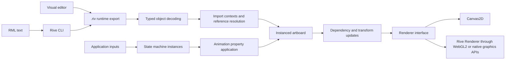

# Rive architecture: evidence for Evir

Research date: 2026-10-06. This document separates inspected implementation from behavior verified in a browser. The source revisions and reproduction commands are in [Sources](sources.md) and [Research workflow](../research/README.md).

## Findings

Rive combines a compact scene description, an animation and interaction runtime, and a rendering backend. File size alone does not explain performance: dependency-driven scene updates, interpolation, state evaluation, draw batching, the chosen graphics backend, and asset decoding all contribute. Evir can now author a small compatible subset from scratch and exercise it using official runtimes. We have not built an independent Evir rendering engine or demonstrated parity across all Rive features.

The editor's working representation and collaboration identity are distinct from `.riv`. A runtime `Id` is an index in an artboard's component list; current source describes editor IDs as `(client, object)` pairs. RML uses readable pairs such as `0:14`; compilation maps them into the runtime's separate index spaces. An exporter must resolve references and emit objects in import-context order. A generic binary serializer by itself cannot infer those relationships.

## Runtime model

A file can have multiple artboards. Each artboard owns component objects, timelines and state machines. Parents refer to indices in the component list; timelines and machine layers have their own collections. `ArtboardImporter` installs components and separately registers animations/machines. `ImportStack` tracks the latest owner of each context type and resolves references at context replacement and at the end. Consequently, reordering an otherwise well-typed stream can break import.

The animation path is `LinearAnimation → KeyedObject → KeyedProperty → KeyFrame`. A keyed object references a component, a keyed property references its numeric property key, and keyframes carry frame positions and values. The runtime samples these values and applies them to the artboard. Transform dirt and dependency ordering control downstream updates. This avoids expressing every frame as a new scene. Small integer keys and omission of default values reduce export size; embedded images/fonts can dominate it anyway.

An artboard's definition and a running instance should be treated separately. State-machine input values, animation clocks and transition progress are per playback instance. Immutable file data should be shared where supported; do not assume separate on-screen characters require independent copies of every asset or compiled runtime.

## Interaction and state machines

A state machine owns inputs and layers. A layer has entry, exit, any-state and animation/blend states, with outgoing transitions owned by their source state. Transition conditions are attached to the latest transition during import. Layer resolution converts `stateToId` and `animationId` indices into references. At runtime, conditions decide whether a transition can fire, state instances advance animation clocks, and transitions can mix poses over a duration. Multiple conditions on one transition implement AND; separate transition paths can express alternatives. Priority and any-state behavior must be taken from the actual runtime, not replaced with an unordered graph traversal.

The tested compatibility slice uses boolean and number inputs, unconditional entry transitions, equality/inequality conditions, constant poses and looping motion. It checks visible state changes, including returning to the original state. Trigger consumption, blend trees, nested artboards, listeners, data binding, constraints and scripts are studied or structurally decoded where present, but are not covered by generated semantic tests. The current official documentation promotes view-model data binding for broader interactions; the older input primitives remain useful for these focused experiments.

See pinned `src/animation/state_machine_instance.cpp`, `state_transition.cpp`, `transition_bool_condition.cpp`, and the importers listed in [Sources](sources.md). Transition durations on the runtime wire are milliseconds unless a flag requests percentages. Animation frame positions are in frames at the timeline's FPS.

## Bones and deformation

A root bone can be positioned under a transform component. Ordinary bones inherit their origin from the tip of a parent bone. Rotations and lengths drive articulated motion. Our `bones.riv` attaches colored rectangular limbs to two bones and animates their rotations; `characters-25.riv` contains 25 such rigs under a controller. These validate rigid attachment and hierarchy, rather than weighted mesh skinning.

For skinning, `Skin` assembles bone world transforms multiplied by inverse-bind transforms. `Weight::deform` combines matrix contributions with packed weights normalized by 255. The reader recognizes these records using the extracted schema and round-trips the upstream corpus, but we do not claim a generated weighted-mesh exporter.

## Rendering and why backend choice matters

The runtime exposes a renderer abstraction. `@rive-app/canvas` uses Canvas2D; `@rive-app/webgl2` uses the Rive Renderer. These are different rendering paths even though their high-level JavaScript APIs look similar. Features such as vector feathering require the Rive Renderer according to official renderer documentation.

The inspected Rive Renderer uses adaptive tessellation, coverage/path identifiers, pixel-local storage and batching. `renderer/include/rive/renderer/gpu.hpp` documents error targets of 1/4 pixel for parametric curve tessellation and 1/8 pixel for stroke edges; path identifiers allow several paths to share coverage storage without clearing it between every path. Triple-buffered GPU rings allow CPU preparation to overlap graphics execution. `RenderContext::select_interlock_mode` selects raster-ordering, atomic or depth/stencil strategies based on platform support and frame options. Thus there is no single backend-independent 'Rive FPS' number.

Both web packages pass our generated-file checks. WebGL2 here uses ANGLE/SwiftShader, a software graphics implementation. The measured results are a reproducible cloud baseline, not a claim about hardware-accelerated mobile rendering. Frame scheduling, callback CPU work, GPU completion and total process memory are reported separately in [Benchmarks](04-benchmarks.md).

## Rive Markup Language (RML)

RML is an XML representation of a scene, with type names as elements, properties as attributes and nested elements expressing relationships. The official Rive CLI can compile multiple fragments together into `.riv`, and can produce an editor `.rev`. Typical fragments start with `<Rive version="1" kind="fragment">`. They do not declare a `Backboard`; project configuration creates it. IDs must be unique across the project. Colors use ARGB hex without `#`, rotations use radians, and references can cross fragments.

RML is useful as a reviewable authoring layer and makes part of the original project's 'create files outside the editor' objective available through an official tool. Evir should assess it before investing in a full competing authoring language. It does not remove the need to understand runtime layout, export compatibility, animation semantics or rendering performance.

We read the official RML and CLI documentation and actual upstream `.rml` fixtures. Direct website and CLI-installer requests were refused by the workspace HTTPS proxy; the official documentation Git repository was accessible. No CLI binary was installed or used, and no official RML compilation is claimed. Our independently generated `.riv` files use `tools/generate_fixtures.py` and `tools/riv.py`, with acceptance and visible behavior verified by the official web packages.
