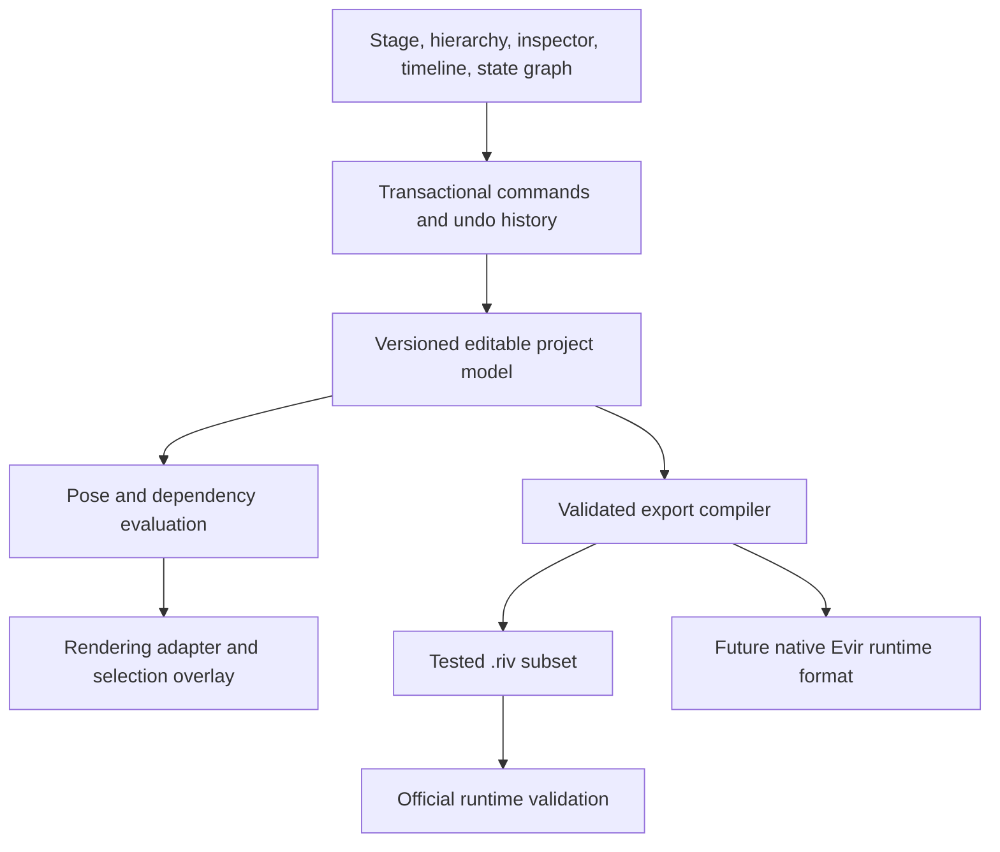

# Editor research: project model, workflows, and first implementation slice

Editor research starts now, following the user's 2026-10-08 instruction to defer the device audit and move on. The runtime experiments remain available as export-validation tools. Physical-device measurements and the four previously specified equivalent Editor scenes remain pending; neither prevents this research work.

## Evidence from the supplied Editor export

`28761-54484-sobo.riv` is a user-supplied runtime export, received on 2026-10-08. Its Editor version and original export timestamp were not supplied. The [inventory](../research/results/editor-export-inventory.json) records its original name, SHA-256, format version, object counts and artboard contents without printing embedded asset payloads.

The file is 2,744,286 bytes, uses format 7.3, and contains 35,206 records across 13 artboards, 78 animations and 20 state machines. The pinned schema recognizes every encountered type and property. Both raw-preserving and value-encoding writer modes reproduce the entire file exactly. This is stronger structural evidence than the small synthetic scenes, but both modes are rewriting the same document, not independently constructing an equivalent character.

Notable records include 632 cubic weights, 95 skins, 184 tendons, 174 root/child bones, 780 feathers, 208 clipping shapes, 469 linear gradients, 118 radial gradients, 35 IK constraints, seven text objects, a font asset, an image asset, a view model and 147 binding contexts. These counts are serialized occurrences across artboards, not counts of distinct assets or independently tested behaviors. Most records belong to animation tracks: 15,955 double keys, 5,392 keyed properties and 1,878 keyed objects.

The [Canvas2D results](../research/results/editor-export-canvas.json) and [WebGL2 results](../research/results/editor-export-webgl2.json) check nonempty rendering on every artboard, match all imported animation/machine names against the structural inventory, and confirm that every named state machine starts. Selected animation poses are sampled at 0.5 seconds. WebGL2 screenshots preserve those authored/sampled poses. These are smoke checks, not assertions of correct rigging, listener semantics, animation fidelity or equivalence between renderers. Canvas2D lacks vector feathering; WebGL2 uses this cloud's software graphics implementation. Neither establishes physical-device performance. The provided scene does not replace the four controlled equivalent-scene comparisons.

Reproduce with `npm run research:editor-export`. The committed fixture retains its original ownership; no new license for the supplied artwork is inferred from this repository's source code.

## What public Rive documentation establishes

The cited documents are pinned to the previously studied official docs revision. They describe observable workflows; they do not expose Rive's closed editor implementation.

| Documented workflow                                                                  | Implication for Evir                                                                                                        |
| ------------------------------------------------------------------------------------ | --------------------------------------------------------------------------------------------------------------------------- |
| Design changes defaults; Animate changes may create keys                             | Every edit must explicitly target the base value or a timeline key. Scrubbing must never write defaults.                    |
| Hierarchy controls nesting and default draw order; custom draw order can override it | Parent references and sibling ordering need explicit semantics; animation-driven ordering is a separate feature.            |
| Lock and isolate are editor controls absent from runtime exports                     | Persist authoring controls independently from runtime data.                                                                 |
| Bone weights can apply independently to vertices and Bézier handles                  | Store control-point influence data, not just a shape-to-bone association.                                                   |
| Dependency visualization includes constraints                                        | A scene tree alone cannot represent evaluation dependencies.                                                                |
| Listeners distinguish target, event and actions                                      | Use typed graph records and inspector forms rather than arbitrary strings.                                                  |
| `.rev` backup contains information stripped from `.riv`                              | An imported `.riv` is an incomplete source document. Exporting and saving an editable project must be different operations. |

## Proposed Evir architecture

This is the target architecture, not a claim about Rive's internals. The initial [Studio foundation](../editor/README.md) now implements the project model, transaction history and a Design workspace for groups and rectangles. Timeline, rigging, state-machine authoring and export compiler remain subsequent milestones. The [UX study](11-editor-ux-research.md) guides the workspace decisions.

The editable project should use stable IDs, explicit references and schema-versioned JSON with asset files. An initial directory or ZIP bundle is sufficient; a new compressed runtime format is not required to prototype authoring. Store artboards, scene nodes, paths, paints, rigs, timelines, machines and typed model properties as separate collections. Asset metadata should identify content by hash. Store editor-only visibility/locking, graph positions, guides and selection history separately; runtime-visible properties must remain clearly distinguishable.

Do not use `.riv` object indices as permanent IDs. Compilation should allocate each required reference namespace and produce an ID-to-export-index diagnostic map. The existing structural parser does not resolve all owner/reference contexts, so its flat record array must not masquerade as a semantic scene graph. Unknown records and properties should survive inspection and lossless re-export; unsupported semantic edits must produce a visible diagnostic rather than silently drop content.

All document edits should pass through transactions with before/after values. A drag previews intermediate values and commits one undo step on release. Cancel restores the pre-drag state. Undo/redo must cover dependent references and asset changes atomically. Reparenting should preserve the world transform by calculating the new local transform; reject singular parent transforms. Deleting a node requires an explicit policy for tracks, constraints, skins and listener references. Autosave must save a consistent version, not an intermediate drag or partially rewritten asset bundle.

Keep the authored base pose immutable during preview. Timeline evaluation produces a separate pose at an explicit time, with frame-to-second conversion performed once. State-machine simulation gets a separate mutable instance; restarting preview restores defaults and resets inputs/model state. Use deterministic stepping for correctness tests, requestAnimationFrame for normal playback. Editor gizmos and selection outlines should occupy an overlay independent from scene clipping and draw order.

A runtime render is useful as an export oracle, but the current high-level wrapper does not provide all control-point and editing operations. A first stage can render a small supported scene model directly with Canvas2D and use exported `.riv` in a separate preview panel. Feathering requires a compatible render adapter later. Do not promise matching output for unsupported paints. Keep rendering behind an interface so the editor project model does not depend on one backend's objects.

The supplied file's thousands of tracks imply searchable, virtualized hierarchy and timeline views, lazy expansion of properties, and incremental invalidation. Geometry changes should invalidate the relevant path and dependents, not rebuild every artboard. Parsing/asset decoding can move to a worker after profiling; command ordering and project ownership should remain explicit. There are no measurements yet demonstrating that a particular UI framework or worker design meets this workload.

## RML as an authoring path

The six existing local RML projects establish a useful human-readable export target. CLI schema lookup can describe available fields, and local verify/inspect/build can validate generated projects. Keep IDs stable and generate typed property names where unambiguous. Validate reference existence, animation property/keyframe type, binding target type, weight normalization and fill-rule compatibility before invoking the CLI: prior experiments showed that some errors compile or inspect cleanly yet do nothing at runtime.

RML can be an optional compiler output and debugging representation. It should not be the sole editor persistence layer. The CLI grammar has export limitations, reference contexts and some editor authoring conventions that need explicit mappings; UI locks, selection, undo history and graph placement require their own project data. CLI acceptance is followed by official-runtime behavioral checks. Local RML compilation is already exercised; round-trip recovery of this large runtime export into a fully editable RML project is not established.

## First implementation milestone and acceptance criteria

Start with a single artboard and one path-based interactive character. Build the project model and transaction engine before expanding UI features.

1. Create/open/save a project with stable IDs, assets and schema version. Reject corrupt references with actionable diagnostics. Save/open must preserve all supported content and editor settings.
2. Stage, hierarchy and inspector support selection, pan/zoom, creation, transforms, reparenting, order changes and grouped undo/redo. Verify world-transform preservation and cancellation using nonidentity parents.
3. Add Bézier point/handle editing and solid paints, then a bone chain with editable normalized control-point weights. Test deformation against the existing weighted fixtures.
4. Add a timeline with typed keys, interpolation, deterministic scrub and separate base pose. Editing a key must not mutate the design defaults; repeated scrubbing must return the same pose.
5. Add one machine layer with entry, animation states, boolean/number/trigger inputs, conditional transitions and a pointer listener. Preview restart must reset state; graph edits must survive save/open.
6. Compile the declared supported subset to `.riv`, validate imports and chosen poses through both official runtimes, and preserve a source-to-export map. Unsupported features must be listed before export.

Use existing original and weighted fixtures for correctness. Use SOBO as a scale and import-inspection workload; editing it remains a separate milestone because its text/layout, IK, nested artboards, converters and model-driven interactions exceed the initial subset. Independent GPU rendering, multiuser collaboration, library synchronization, scripting and full `.riv` semantic import are later milestones. Device measurements stay pending until the user supplies audit results.

## Sources and implementation references

Official docs repository revision: `8879acbbefbf676c8d68d66c2ddfe56c6ee50914`.

- [Design and Animate modes](https://github.com/rive-app/rive-docs/blob/8879acbbefbf676c8d68d66c2ddfe56c6ee50914/editor/fundamentals/design-vs-animate-mode.mdx)
- [Hierarchy and editor-only controls](https://github.com/rive-app/rive-docs/blob/8879acbbefbf676c8d68d66c2ddfe56c6ee50914/editor/interface-overview/hierarchy.mdx)
- [Backup exports](https://github.com/rive-app/rive-docs/blob/8879acbbefbf676c8d68d66c2ddfe56c6ee50914/editor/exporting/exporting-for-backup.mdx) and [runtime exports](https://github.com/rive-app/rive-docs/blob/8879acbbefbf676c8d68d66c2ddfe56c6ee50914/editor/exporting/exporting-for-runtime.mdx)
- [Bones and independent handle weights](https://github.com/rive-app/rive-docs/blob/8879acbbefbf676c8d68d66c2ddfe56c6ee50914/editor/manipulating-shapes/bones.mdx)
- [Dependencies](https://github.com/rive-app/rive-docs/blob/8879acbbefbf676c8d68d66c2ddfe56c6ee50914/editor/workflows/dependency-graph.mdx) and [listeners](https://github.com/rive-app/rive-docs/blob/8879acbbefbf676c8d68d66c2ddfe56c6ee50914/editor/state-machine/listeners.mdx)
- Official CLI 1.4.0 bundled `format.md`: XML grammar, scoped references, keyframe types and known limitations. Executed RML evidence is documented in [the prior audit](09-runtime-research-closure.md).

Further implementation study candidates are [Penpot](https://github.com/penpot/penpot) for document editing and [tldraw](https://github.com/tldraw/tldraw) for interaction patterns. Their current license files were fetched on 2026-10-08: Penpot uses MPL-2.0; tldraw uses its own license with production terms. No code or dependency from either is adopted here. These are candidates for a focused follow-up, not completed architecture comparisons or a reason to assume unrestricted reuse.
